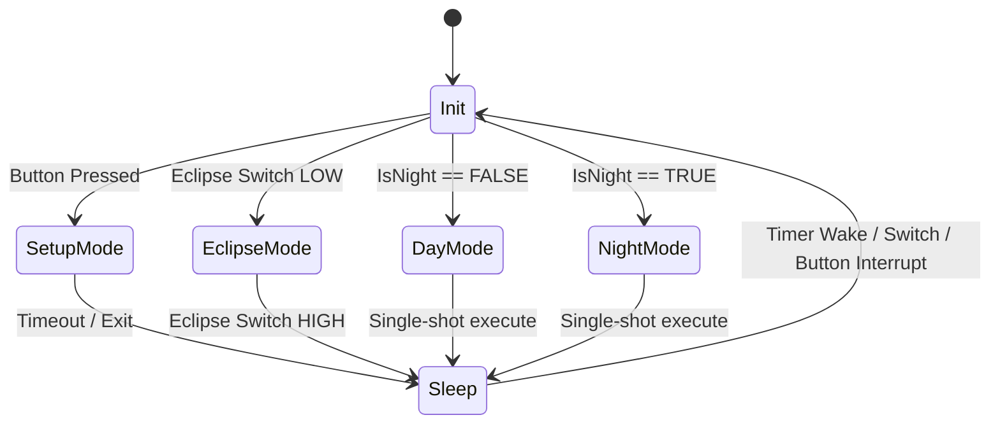
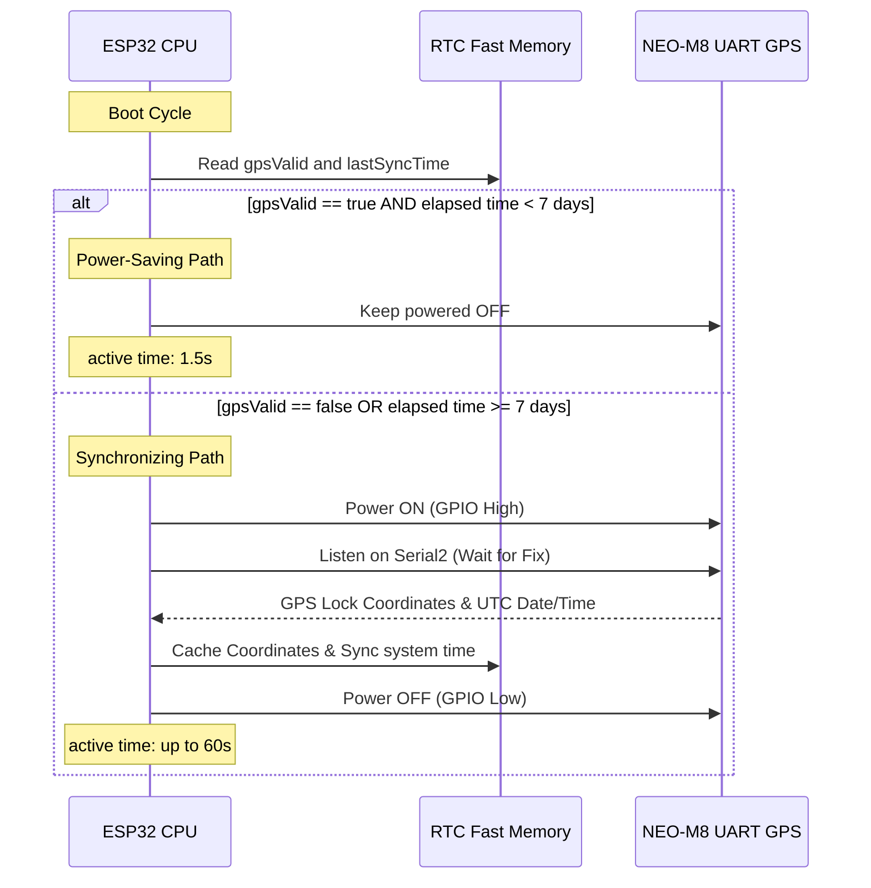

# System Documentation: ESP32 Sky Quality Meter (SQM) Station

This document establishes the comprehensive technical documentation, system architecture, mathematical models, power management schemes, and deployment instructions for the ESP32-based Sky Quality Meter (SQM).

---

## 1. System Overview & Architecture

The ESP32 Sky Quality Meter is a high-precision, battery-powered IoT instrument designed to measure night sky brightness (MPSAS), meteorological conditions, and celestial cloud cover. The system is designed for long-term remote field operations. It utilizes a highly modular Hardware Abstraction Layer (HAL) and co-existing LoRaWAN/WiFi transmission channels.

### Block Diagram

```mermaid
graph TD
    subgraph ESP32 Main Processor
        core[ESP32-WROOM-32D]
        rtc[RTC Fast Memory]
        timer[RTC Wakeup Timer]
    end

    subgraph I2C Sensor Bus (100 kHz)
        ina[TI INA3221 Power Monitor]
        hmc[Honeywell HMC5883L Magnetometer]
        bme[Adafruit BME280 Env Sensor]
        mlx[Melexis MLX90614 Sky Temp]
        bno[Adafruit BNO055 IMU]
        eep[AT24C32 EEPROM Memory]
        oled[SSD1306 OLED Display]
    end

    subgraph Hardware Interfaces
        gps[NEO-M8 UART GPS]
        btn[USER Setup Button]
        sw[Eclipse Mode Toggle Switch]
    end

    subgraph Power Path Subsystem
        solar[Solar Panel / USB Input]
        pmic[MCP73871 Charger & PMIC]
        batt[3.7V Li-Po Battery]
        reg[3.3V LDO Regulator]
    end

    subgraph Transmission Channels
        lora[SX1276 LoRa / LoRaWAN]
        wifi[WiFi Router / HTTP POST]
    end

    %% Electrical/I2C connections
    core -->|SDA/SCL - GPIO 21/22| I2C Sensor Bus
    core -->|Serial2 - GPIO 16/17| gps
    core -->|GPIO 12| btn
    core -->|GPIO 13| sw
    core --> lora
    core --> wifi
    core -->|RTC State Retention| rtc
    timer -->|Periodic Boot Triggers| core

    %% Power Path Monitoring Connections
    solar -->|Channel 2 Shunt| pmic
    pmic -->|Channel 1 Shunt| batt
    pmic -->|Channel 3 Shunt| reg
    reg -.->|3.3V VCC Rail| core
    reg -.->|3.3V VCC Rail| I2C Sensor Bus
    reg -.->|3.3V VCC Rail| gps
```

### Hardware Interfacing Specifications

All peripherals communicate with the ESP32 via shared I2C buses, high-speed UART serial lines, or dedicated GPIO interrupt lines. Physical pull-up resistors of **2.2kΩ** must be used on the SDA and SCL lines to mitigate rise-time issues at 3.3V, especially given the capacitive loads on the bus.

| Hardware Peripheral | Physical Connection | Default ESP32 Pins | I2C Address / Baud | Sleep Current |
| :--- | :--- | :--- | :--- | :--- |
| **ESP32-WROOM-32D** | System Controller | N/A | N/A | < 10 µA (Deep Sleep) |
| **SSD1306 OLED** | Shared I2C Bus | SDA: 21, SCL: 22 | `0x3C` | < 10 µA (Command `0xAE`) |
| **USER Button** | Menu Interrupt | GPIO 12 | Internal Pullup | N/A |
| **Eclipse Switch** | Hardware Toggle | GPIO 13 | Internal Pullup | N/A |
| **NEO-M8 GPS** | Hardware Serial2 | RX2: 16, TX2: 17 | 9600 baud | 0 µA (MOSFET Cutoff) |
| **AT24C32 EEPROM** | Shared I2C Bus | SDA: 21, SCL: 22 | `0x50` | < 2 µA (Auto-standby) |
| **BME280 Env** | Shared I2C Bus | SDA: 21, SCL: 22 | `0x77` | < 0.2 µA (Sleep Mode) |
| **TSL2591 Light** | Shared I2C Bus | SDA: 21, SCL: 22 | `0x29` | < 1.2 µA (Standby) |
| **MLX90614 Temp** | Shared I2C Bus | SDA: 21, SCL: 22 | `0x5A` | < 2 µA (Sleep Mode) |
| **BNO055 IMU** | Shared I2C Bus | SDA: 21, SCL: 22 | `0x28` | < 40 µA (Suspend Mode) |
| **HMC5883L Mag** | Shared I2C Bus | SDA: 21, SCL: 22 | `0x1E` | < 2 µA (Idle Mode) |
| **INA3221 Shunt** | Shared I2C Bus | SDA: 21, SCL: 22 | `0x40` | < 10 µA (Monitors Solar In, Battery, and System Load) |

---

## 2. Firmware Modularity & HAL Compilation Toggles

To provide complete flexibility for custom hardware builds, the firmware incorporates a compile-time Hardware Abstraction Layer (HAL) using preprocessor macros. Commenting out a macro completely excludes its drivers, saving massive flash memory.

Located at the top of [config.h](file:///c:/Users/calan/OneDrive/Documenti/Python%20Scripts/sqm/include/config.h):

```cpp
#define ENABLE_BME280      // Environmental Sensor
#define ENABLE_TSL2591     // Sky Quality Brightness Sensor
#define ENABLE_MLX90614    // Sky Temp Cloud Sensor
#define ENABLE_BNO055      // IMU Alignment Sensor
#define ENABLE_HMC5883L    // Compass Heading Magnetometer
#define ENABLE_INA3221     // Battery Power Monitor
#define ENABLE_AT24C32     // EEPROM Non-Volatile Logger
#define ENABLE_GPS         // NEO-M8 Satellite Clock/Sync
#define ENABLE_OLED        // SSD1306 Display & USER Button
```

### Volatile Preprocessor Guards
All library inclusions, sensor object declarations, setup routines, telemetry readings, and sleep directives are wrapped in `#ifdef ENABLE_XXX` wrappers in [main.cpp](file:///c:/Users/calan/OneDrive/Documenti/Python%20Scripts/sqm/src/main.cpp).

If a module is compiled out, the Setup Mode display automatically adapts:
* Page 0 (System Status) displays `---` (compiled-out) instead of running a live hardware check on that address.
* Page 1 (Zenith Alignment bubble level) displays `[BNO055 DISABLED] Alignment cursor compiled out` and disables Pitch/Roll calculations.
* If `ENABLE_OLED` is disabled, the entire screen library, button debouncing, and `ext0` sleep triggers are excluded. The ESP32 logs data and sleeps directly.

---

## 3. Data Struct & Memory Allocation Geometry

To maintain complete telemetry and downstream decoder compatibility across different feature toggle configurations, the `SQMDataPacket` structure has a constant width of **23 bytes**:

```cpp
struct __attribute__((packed)) SQMDataPacket {
    uint32_t timestamp;      // Epoch/Simulated timestamp (4 bytes)
    float sqm_reading;       // MPSAS value (4 bytes)
    int16_t amb_temp;        // BME280 Temp * 100 (2 bytes)
    uint16_t amb_press;      // BME280 Pressure in hPa (2 bytes)
    uint16_t amb_hum;        // BME280 Humidity * 100 (2 bytes)
    int16_t mag_x;           // HMC5883L Raw X (2 bytes)
    int16_t mag_y;           // HMC5883L Raw Y (2 bytes)
    int16_t mag_z;           // HMC5883L Raw Z (2 bytes)
    uint16_t batt_mv;        // INA3221 Bus Voltage (2 bytes)
    uint8_t checksum;        // Maxim/Dallas CRC8 of previous 22 bytes (1 byte)
}; // Total: 23 Bytes
```

### Sentinel Values for Disabled Sensors
If a sensor toggle is commented out, the firmware automatically populates its fields with designated sentinel values:

* **TSL2591 Disabled**: `sqm_reading` $\rightarrow$ `-2.0f` (differentiates from Day Mode `-1.0f`).
* **BME280 Disabled**: `amb_temp`, `amb_press`, `amb_hum` $\rightarrow$ `0`.
* **HMC5883L Disabled**: `mag_x`, `mag_y`, `mag_z` $\rightarrow$ `0`.
* **INA3221 Disabled**: `batt_mv` $\rightarrow$ `0`.
* **GPS Disabled**: `timestamp` $\rightarrow$ simulated runtime timer (`rtc_bootCount * 300`).

### AT24C32 EEPROM Logging Architecture
* **Page Boundary Safety**: The AT24C32 has 32-byte physical write pages. Because the packet is 23 bytes, we write each packet at a **32-byte record spacing** (`index * 32`). This guarantees no packet ever crosses a page boundary, eliminating split-write page wraparound errors.
* **Persistent Write-Head Scan on Boot**: To protect against data overwrites during power cycles or manual resets, the EEPROM performs a monotonic scan on boot:
  1. Scans all 128 indices.
  2. Reads each 32-byte record, validating the CRC8 checksum.
  3. Identifies the record with the maximum timestamp.
  4. The next write index is set to `(max_timestamp_index + 1) % 128`, resuming circular logging with zero wear overhead.

---

## 4. Operational Modes Logic

The system shifts between three operational modes based on celestial schedules or hardware overrides:



### Day Mode
* **Celestial State**: Astronomical day.
* **Sleep Duration**: **5 minutes** (300 seconds).
* **Sensing Block**: BME280, BNO055, HMC5883L, INA3221 active. TSL2591 remains powered off in standby; `sqm_reading` is populated with the daytime sentinel `-1.0f`.

### Night Mode
* **Celestial State**: Astronomical night.
* **Sleep Duration**: **3 minutes** (180 seconds).
* **Sensing Block**: **All** sensors active. TSL2591 powers up, integrates light under max gain for 400ms, calculates MPSAS, and is powered off.

### Eclipse Mode
* **Celestial State**: Active solar eclipse.
* **Trigger Source**: Physical hardware toggle switch (`GPIO 13`) pulled `LOW`.
* **Sleep Duration**: **Deep sleep is completely disabled.** The ESP32 remains fully awake.
* **Awake Loop**: Executes a non-blocking `millis()` loop **every 2 seconds** (2000ms), reading all sensors (including fast 100ms TSL2591 integration), updating the OLED screen in real time, and transmitting telemetry.
* **Wear Protection**: To protect the AT24C32 from wear (128 records would overwrite in 4.2 minutes), writing is controlled via a configuration toggle:
  ```cpp
  #define LOG_ECLIPSE_TO_EEPROM false // Off by default; transmits live over LoRa/WiFi
  ```

---

## 5. Mathematical Models

### A. TSL2591 Sky Quality Meter (MPSAS) Calculation
To convert digital lux readings into astronomical sky brightness magnitude per square arcsecond:
$$MPSAS = ZP - 2.5 \log_{10}(\text{lux})$$
* **Zero Point ($ZP$)**: Default calibration baseline is `21.0f`.
* **Absolute Darkness Clamp**: If lux is `0.0f` (perfect darkness), MPSAS is clamped to `22.0` (natural dark sky limit). Bounded to range `[0.0, 22.0]`.

### B. Offline Solar Calculator (Astronomic Day/Night Detection)
The offline `SolarCalculator` module implements the complete NOAA solar position formulas. Given a latitude, longitude, and UTC date, it calculates UTC sunrise and sunset in minutes from midnight:

1. **Calculate Sun's Mean Anomaly ($M$)** at time $t$:
   $$M = 0.9856 \times t - 3.289$$
2. **Calculate Sun's True Longitude ($L$)**:
   $$L = M + 1.916 \sin(M) + 0.020 \sin(2M) + 282.634$$
3. **Calculate Sun's Right Ascension ($RA$) and Declination ($\delta$)**:
   $$RA = \arctan(0.91746 \tan(L))$$
   $$\sin\delta = 0.39782 \sin(L)$$
4. **Calculate Sun's Hour Angle ($H$)** relative to standard horizon zenith angle $90.833^\circ$ (accounting for semi-diameter and refraction):
   $$\cos(H) = \frac{\cos(90.833) - \sin\delta \sin(\text{latitude})}{\cos\delta \cos(\text{latitude})}$$
5. **Convert local rising/setting times to UTC minutes from midnight**.
6. **Time check**: If current UTC minutes from midnight is less than sunrise or greater than sunset, astronomical **Night** is active.

### C. Orientation-Based Tilt Compensation
To horizontalize the 3D magnetometer vector $(X, Y, Z)$ using BNO055 pitch ($\theta$) and roll ($\phi$) angles in radians:
$$X_H = X \cos\theta + Y \sin\theta \sin\phi + Z \sin\theta \cos\phi$$
$$Y_H = Y \cos\phi - Z \sin\phi$$
$$\text{Tilt-Compensated Heading} = \arctan2(-Y_H, X_H) \times \frac{180}{\pi}$$

### D. HMC5883L Self-Test & Auto-Gain Limit Scaling
During boot, a positive bias current (~10 mA) is applied. At Gain 5 (±4.7 Ga range), the expected output must lie in the range `[243, 575]` LSb. If a different gain $G_{new}$ is configured, limits are auto-scaled:
$$Limit_{adj} = Limit_{G5} \times \frac{\text{Sensitivity}_{new}}{\text{Sensitivity}_{G5}}$$
* Sensitivity at G5 = 390.0 LSb/Gauss.

### E. Sensitivity Temperature Compensation
To stabilize magnetometer readings against thermal drift without adding extra housing sensors:
$$X_{Comp} = \frac{STP_{cal}}{STP_{curr}}$$
* $STP_{cal}$: Baseline factory calibration positive bias magnitude ($\sqrt{X^2 + Y^2 + Z^2}$).
* $STP_{curr}$: Current positive bias magnitude measured at runtime.
* The compensation factor $X_{Comp}$ is applied directly to all magnetometer axes to eliminate temperature drift.

### F. OLED Zenith Alignment Bubble Level Cursor Translation
Page 1 of the Setup Mode menu maps BNO055 Pitch ($\theta$) and Roll ($\phi$) in degrees to 2D screen coordinate offsets:
$$\text{Bubble}_X = 64 + \text{Roll}$$
$$\text{Bubble}_Y = 32 + \text{Pitch}$$
Offsets are clamped to a $\pm 20$ pixel bounding radius from the screen center $(64, 32)$.

---

## 6. Dynamic GPS Clock & Coordinate Caching (Power Budget)

GPS modules consume up to **50mA** during locking. Waiting for a cold lock on every wake cycle would exhaust battery reserves.



Once synchronized once, the ESP32 system clock (ticking via standard `time(nullptr)`) continues running and automatically advances during Deep Sleep.

---

## 7. Dual co-existing Transmitters

The codebase includes completely decoupled `LoRaManager` and `WiFiManager` modules. You can toggle between them in `config.h`.

### LoRa / LoRaWAN Transmitter
* **LoRa P2P**: Direct packet broadcast via standard `<LoRa.h>` to a local gateway.
* **LoRaWAN (LMIC)**: Queue-based unconfirmed OTAA packet transmit on port 1.
* **OLED Diagnostics**: Displays animated LoRaWAN `JOINING...`, `CONNECTING`, and `READY (OTAA)` parameters.

### WiFi HTTP POST Transmitter
* **Routine**: Connects to SSID, constructs a JSON payload, POSTs to your target endpoint using `<HTTPClient.h>`, and immediately disconnects.
* **JSON Payload Format**:
  ```json
  {
    "timestamp": 17829032,
    "sqm": 21.4325,
    "temp": 18.52,
    "press": 1013,
    "hum": 45.21,
    "mag_x": 120,
    "mag_y": -34,
    "mag_z": 452,
    "batt_mv": 3280,
    "checksum": 142
  }
  ```
* **OLED Diagnostics**: Page 2 initiates a background connection attempt, displaying router SSID, IP Address, and active signal strength in **RSSI (dBm)**.

---

## 8. Deployment & Troubleshooting Guide

### PlatformIO CLI Compiling
1. Open the `sqm` directory.
2. Compile code: `pio run`
3. Upload binary to ESP32: `pio run --target upload`
4. Open the serial console at 115200 baud: `pio device monitor`

### Command Utility (Serial Interface)
While connected to the ESP32 via a serial terminal (115200 baud), you can send:
* `d` or `D`: Wipes active buffers and dumps all valid logs in the AT24C32 EEPROM in clean CSV format.
* `w` or `W`: Wipes all logged data records in the EEPROM (fills all blocks with `0xFF`).

### Troubleshooting Diagnostics

| Symptom | Probable Cause | Action |
| :--- | :--- | :--- |
| **System halts at boot** | INA3221 rail voltage is outside HMC operational limits (2.16V - 3.6V). | Check battery supply level; measure V_DD voltage on the HMC module pins. |
| **OLED does not wake** | Display reset or incorrect I2C address. | Verify OLED I2C address defaults to `0x3C`. Ensure I2C pullup resistors are present. |
| **GPS Sync Timeout** | No line of sight to sky. | Move the station outdoors or connect an active external GPS antenna. |
| **TSL2591 reports `-2.000`** | Light sensor is disabled in code. | Enable `#define ENABLE_TSL2591` in `config.h`. |
| **TSL2591 reports `-1.000`** | System is in Day Mode. | Normal behavior; the sensor is kept asleep during the day to prevent sun damage. |
| **OLED Alignment static** | BNO055 module failure. | Check System Status Page (Page 0) to verify `BNO:OK`. If `ERR`, inspect I2C bus wiring. |

---

## 9. Power Path Management & Charge Control (MCP73871 & INA3221)

To ensure high-precision, uninterrupted measurements across deep sleep cycles and high-speed eclipse loops, the SQM station integrates an intelligent power management system.

### A. MCP73871 Intelligent Power Path Controller
The MCP73871 manages incoming energy from the solar panel or USB and routes it dynamically using smart load-sharing logic:
* **Solar/USB Power Available**: The PMIC powers the system load directly while charging the battery. The battery is completely isolated from system load current, preventing shallow cycle charging wear and maximizing battery lifetime.
* **Charging Current Profiles**: The charge current is configured in the hardware via inline program resistors:
  * **Fast Charge Current (Li-Po)**: Controlled by `PROG1` (typically set to 500mA-1000mA).
  * **USB Current Limit**: Controlled by `PROG2` (switches between 100mA and 500mA based on logic states).
* **Automatic Switchover**: If Solar/USB power drops or is disconnected, the PMIC instantly routes power from the Li-Po battery to the system output rail with **zero switchover delay**, preventing processor brownouts or resets.

### B. Triple-Channel INA3221 Telemetry Analysis
The INA3221 high-side shunt monitor acts as an electrical power auditor, measuring voltage and current across three distinct points:
1. **Channel 1 (Battery Monitor)**: Connected inline with the Li-Po battery. It measures the battery voltage (essential for state-of-charge calculation) and charge/discharge current. 
   * *Charge current* is represented as positive current flow from the charger into the battery.
   * *Discharge current* is represented as negative current flow from the battery into the system.
2. **Channel 2 (Solar/USB Input Monitor)**: Connected between the external solar panel/USB source and the PMIC input pin. It measures the incoming generation voltage and generated solar current.
3. **Channel 3 (System Load Monitor)**: Connected inline with the 3.3V LDO regulator input. It measures the actual current consumed by the ESP32 and active sensors combined, enabling exact power budget calculations in the field.

This combination of the MCP73871 and the INA3221 delivers a high-precision, self-sustaining IoT power system optimized for extreme remote field deployments.
